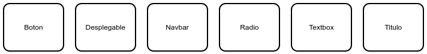

# Teoría de la computación y la compilación

## Integrantes

+ Ana Maria Osorio Mondragon
+ David Londoño Montoya
+ Isabela Lujan Jaramillo
+ Juan Pablo Ciro Londoño
+ Mauricio Zapata Pereira
+ Ricardo José Garzón Arias
+ Salome Aristizabal Giraldo

## Indice

1. [Tecnologías](#tecnologías)
1. [Descripción general de funcionamiento](#Descripción-general-de-funcionamiento)
1. [Reglas](#reglas)
1. [Descripción de símbolos](#descripción-de-simbolos)
1. [Ejecución](#Ejecución)
1. [Ejemplos](#ejemplos)

## Tecnologías

Diagrama:

+ Diagrama de procesos

Generador de diagramas:

+ bpmn.io

Modo de origen:

+ xml

Lenguaje de procesado (Backend):

+ python

+ flask (como framework web)

Front end:

+ Tecnologías web (HTML, CSS, JAVASCRIPT)

## Descripción general de funcionamiento

Cada "lane" del diagrama bpmn representa un widget o formulario,
definimos un widget como un objeto que el usuario puede ver y/o interaccionar
, Titulo, navbar, botones, desplegables etc.
Para definir un widget se deberá usar un "task" de bpmn.

<p align="center" width="50%">
     
</p>

En la imagen anterior vemos la definición de un botón,
el "task" (cuadrado redondeado) define un widget,
el texto al interior del mismo define que tipo de widget
y la anotación será el texto o label del widget.

De forma análoga se realizan el resto de widgets de la aplicación,
y se especifica el orden usando flechas.
Para ver ejemplos más completos puede revisar la sección  [Ejemplos](#ejemplos)

## Reglas

1. No se permite anidar ventanas entre si
2. No se permiten insertar imágenes en la aplicación
3. Si va hacer un formulario solo se puede hacerlo en un lane
4. Solo se puede hacer un formulario por ventana
5. No se pueden dejar lanes vacíos
6. El diagrama se debe realizar en el orden que desea que se muestre
7. Si va a modificar el diagrama debe hacerlo desde el código xml o rehacer las conexiones entre las partes del diagrama para evitar errores en la vista
8. Todos los textbox y radiobutton se deben almacenar, por ende, todos deben tener una conexión con el símbolo de storage
9. No se debe repetir el nombre del símbolo de storage.
10. Si se crea un formulario este debe contener obligatoriamente un boton al final del mismo, este actuara como boton de submit, si no lo tiene no podra guardar informacion

## Descripción de símbolos

+ DataStoreReference (Storage Symbol) -> el nombre del símbolo será el id del elemento al que está conectado en el html.

<p align="center" width="50%">
     
</p>

+ Lane (linea) -> un div en html(incluyendo su contenido)

<p align="center" width="50%">
     
</p>

<p align="center" width="50%">
    (En la imagen las flechas apuntan a tres lanes diferentes)
</p>

Cada lane representa un widget o formulario, si tiene varias cosas es un formulario compuesto de varios widgets.


+ Participant(un participant)-> es una ventana

<p align="center" width="50%">
     
</p>

+ SequenceFlow -> una conexion entre dos o más objetos

<p align="center" width="50%">
     
</p>

<p align="center" width="50%">
    (En la imagen SequenceFlow está conectando dos tareas)
</p>

+ textAnnotation (un comentario) -> contenido de una tarea

<p align="center" width="50%">
     
</p>

+ Task (una tarea) -> dibujar en pantalla un widget/elemento(el nombre de la tarea lo define) y el nombre/titulo de ese elemento(definido por el comentario)

<p align="center" width="50%">
     
</p>

un widget puede ser:

+ Boton
+ Desplegable
+ Navbar
+ Radio
+ Textbox
+ Titulo


Nota: Los tipos de los widgets son "Case sensitive".
Nota 2: Una aplicación siempre debe tener un navbar al inicio.

## Ejecución

Para ejecutar el programa necesitará:

+ Un navegador WEB
+ Python 3.7
+ Flask (librería de python)
+ Chatterbot (librería de python)

Puede instalar Flask en la mayoría de distribuciones Linux usando el siguiente comando:

```
sudo -H pip3 install flask
```

Puede instalar flask en windows usando este comando:
```
pip install flask
```

Para iniciar la aplicación ejecute desde una terminal (en Windows) el siguiente comando:
```{}
python app/index.py
```
En Linux puede usar este comando:
```{}
./run
```

Para ejecutar el chatbot ejecute desde una terminal (en Windows) el siguiente comando:
```{}
python chatbot/samples.py
```

Luego de iniciar la aplicación ingrese la dirección **localhost:5000** en un navegador WEB.
Una vez esté abierta la venta use el botón browse para agregar un diagrama y el botón enviar para generar la aplicación.

Una vez generada la aplicación web basada en el diagrama bpmn enviado, si la aplicación contiene un formulario podra guardar la informacion del mismo en un archivo .txt el cual se encontrara ubicado en /app/files, una vez alli podra ubicar el archivo con el mismo nombre del diagrama utilizado para generar la pagina, por ejemplo IMC.bpmn.txt

Si rellena la informacion de un formulario en varias ocasiones este se agregara al mismo archivo.

<p align="center" width="50%">
     
</p>

## Ejemplos
Se mostrarán varios ejemplos, primero el diagrama y luego la aplicación generada.

1.

<p align="center" width="50%">
     
</p>

<p align="center" width="50%">
     
</p>

2.

<p align="center" width="50%">
     
</p>

<p align="center" width="50%">
     
</p>
